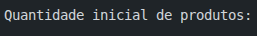
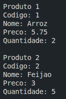
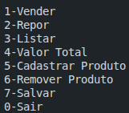
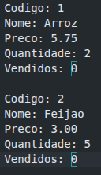

# O Gerenciador de Estoque que o seu mercado precisa!

Ao abrir o programa, a tela inicial é:

Após digitar a quantidade de produtos:

O menu com todas as opções do programa:

Ao digitar "7" para salvar os produtos, o programa cria um arquivo chamado "estoque.txt" e salva os produtos nele:

Para encerrar o programa, digite "0".